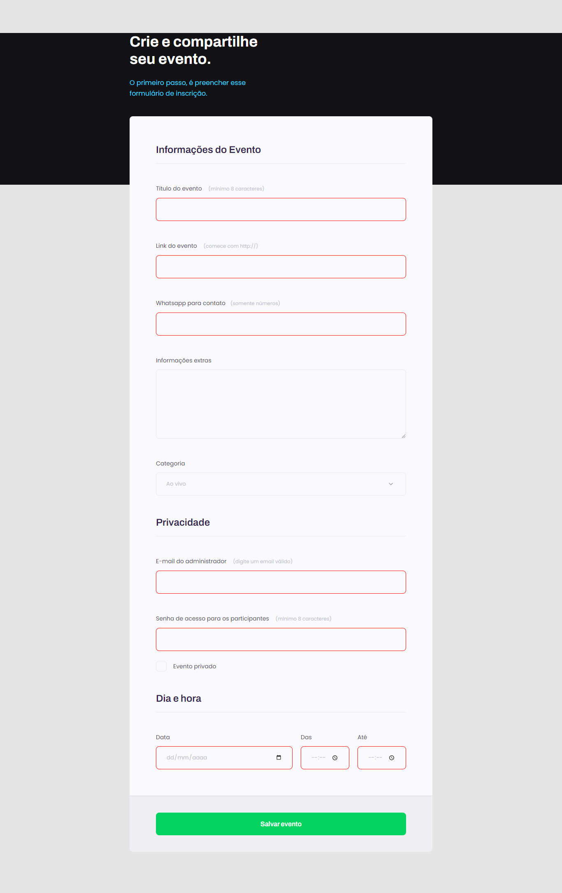

  

## 🖥️ Projeto
Nesse projeto foi trabalhado conceitos de formulários como inputs, labels, button, checkbox e também a validação dos campos que é uma coisa muito importante de se fazer, além do css com o flex cores e outros conceitos muito importantes para a estilização da página .

## 🚀 Tecnologias
Foram utilizadas as seguintes tecnologias:

- HTML
- CSS
- GIT
- GITHUB
- FIGMA

## 👁 View
Aqui você pode visualizar o layout do projeto
<a 
  href="https://www.figma.com/file/DbSyAinoORc5q9Gh50Dvru/Explorer-Stage-03-Projeto-01-(Copy)?type=design&node-id=1-28&t=dQekYehxAlaTxgf2-0">
  clique aqui
</a>
